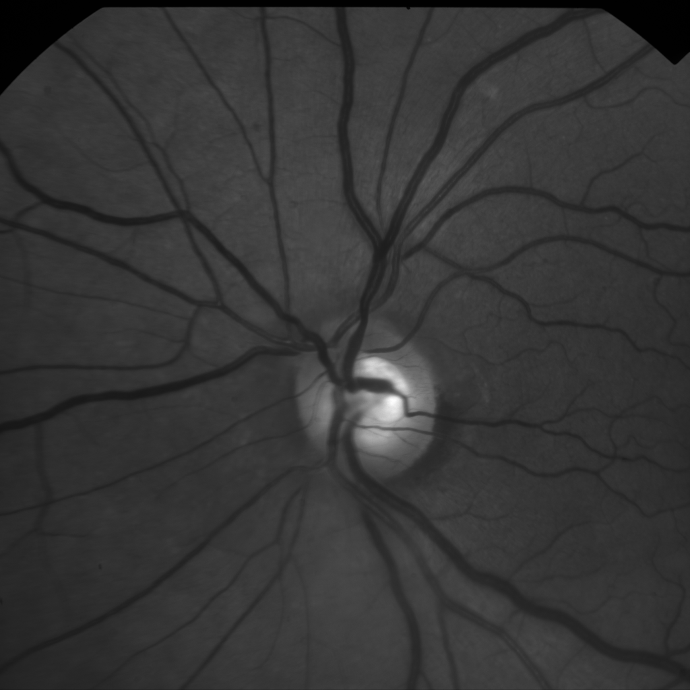
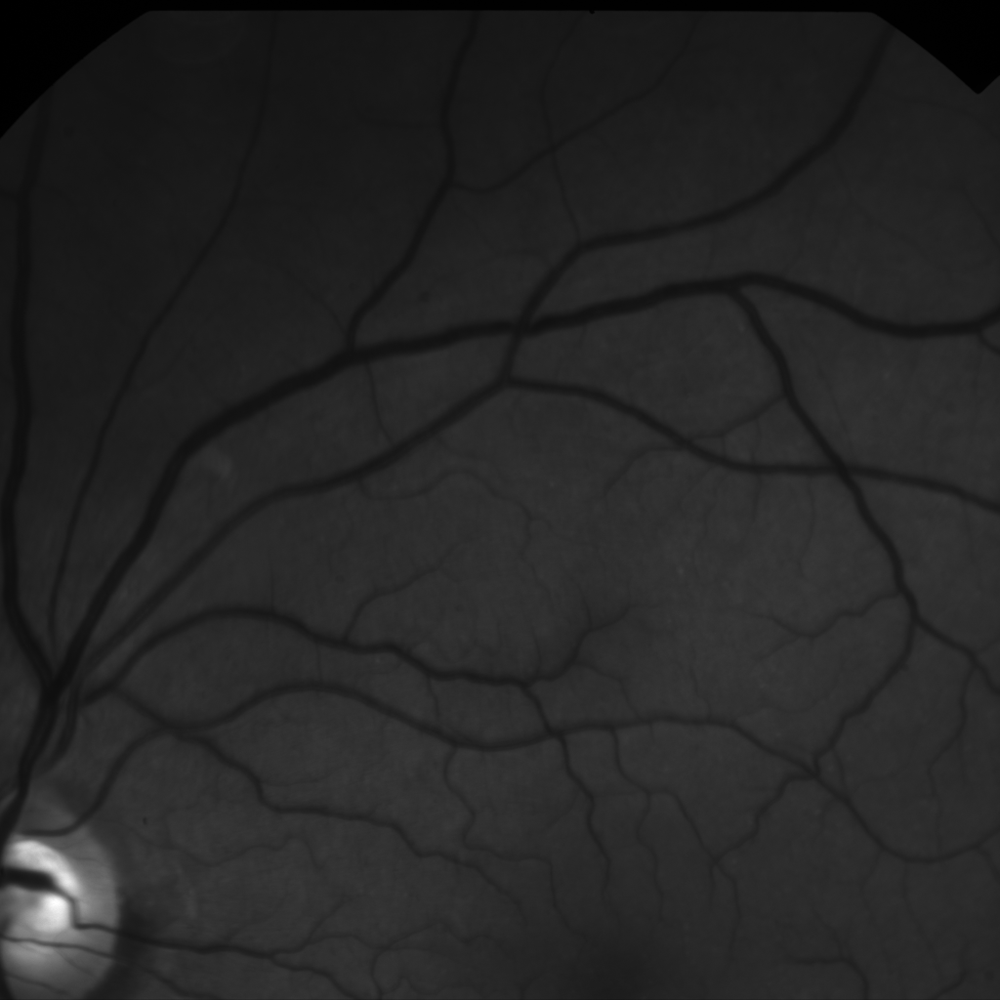
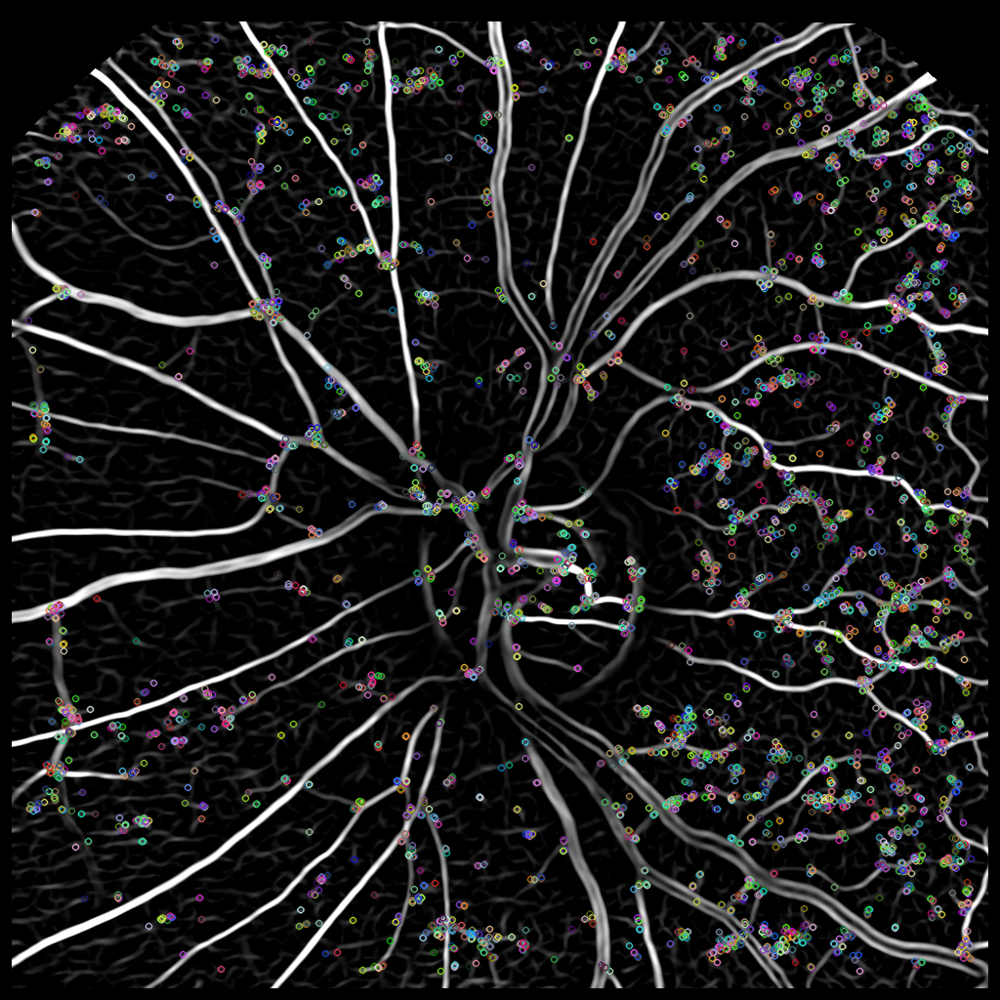
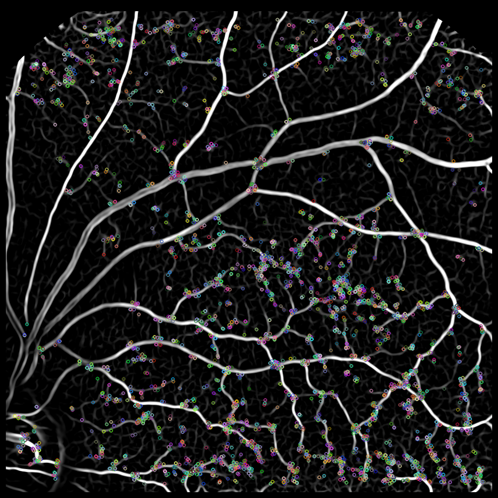
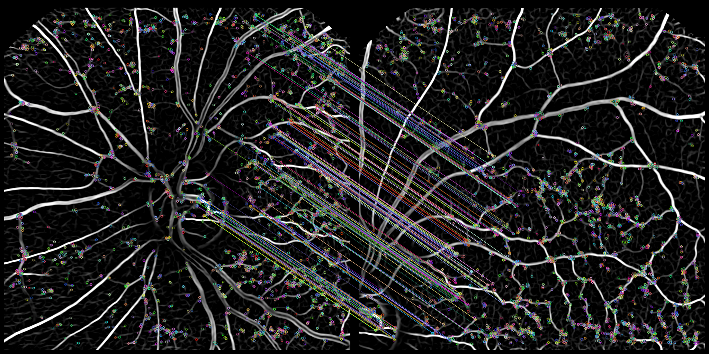
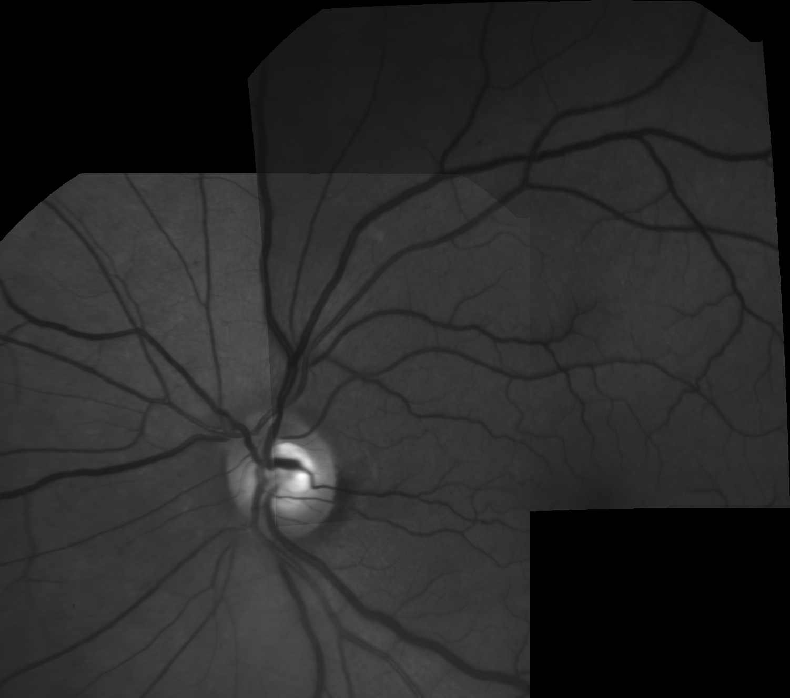

# align-retina-images

Align retina images using OpenCV.

### Key steps of algorithm:

-----------
Select master frame, used as reference image to align images, and a set of frames to be aligned to the master

 

-----------
Use of Frangi-like filter to enhance the vessel structure of the retina image

[Hessian based Frangi Vesselness filter](https://www.mathworks.com/matlabcentral/fileexchange/24409-hessian-based-frangi-vesselness-filter)

See `__frangi2D()`.
	

-----------
Use of OpenCV ORB key point detector and descriptor extractor to extract key points on the Frangi-filtered image

[ORB (Oriented FAST and Rotated BRIEF)](http://docs.opencv.org/3.0-beta/doc/py_tutorials/py_feature2d/py_orb/py_orb.html)

 

See `__extract_keypoints()`.

-----------
Use OpenCV Brute-force descriptor matcher with `normType=NORM_HAMMING2` and `crossCheck=true` to match extracted key points.

[Feature Matching](http://docs.opencv.org/3.0-beta/doc/py_tutorials/py_feature2d/py_matcher/py_matcher.html)

-----------
Use additional application domain specific constraints to drop definitely false matches.

See `__select_best_matches()`.   

-----------
Use of customized version of OpenCV RANSAC procedure `estimateRigidTransform()` for initial estimation 
of affine or full quadratic transform between images, dropping definitely bad matches. 

Application domain specific constraints are applied to drop bad matches.

All positive matches are used to estimate affine or full quadratic transform between images.
  

See `__estimate_transform()`.

-----------
Use of customized version of OpenCV `findTransformECC()` to find precise mapping between two images in terms of the ECC criterion.

[Motion Analysis and Object Tracking](http://docs.opencv.org/3.0-beta/modules/video/doc/motion_analysis_and_object_tracking.html)

See `__ecc_align()`.

Full quadratic transform is used for precise align:

		x' =  a00 * x + a01 * y + a02 + a03 * x * y + a04 * x*x + a05 * y*y
		y' =  a10 * x + a11 * y + a12 + a13 * x * y + a14 * x*x + a15 * y*y

-----------
Use of `__ecc_align()` output transformation matrix to remap slave image to master frame, using OpenCV `remap()`.

 

### Build

GNU/Linux or MinGW:

	`$ make all` 

### Run

	`$ ./align-retina-images example/*.tif`
	
### 

